# Tables of Contents

* [About ICSBookMarket](#about-icsbookmarket)
* [Installation](#installation)
* [Application design](#application-design)
  * [Directory structure](#directory-structure)
  * [Import conventions](#import-conventions)
  * [Naming conventions](#naming-conventions)
  * [Data model](#data-model)
  * [CSS](#css)
  * [Routing](#routing)
  * [Authentication](#authentication)
  * [Authorization](#authorization)
  * [Configuration](#configuration)
  * [Quality Assurance](#quality-assurance)
    * [ESLint](#eslint)
  * [Development History](#development-history)
    * [Milestone 1: Mockup Development](#milestone-1-mockup-development)
    * [Milestone 2: Data Model Development](#milestone-2-data-model-development)
    * [Milestone 3: Connect UI to Data Model and End-User Testing](#milestone-3-connect-ui-to-data-model-and-end-user-testing)
    * [End User Testing](#end-user-testing)
    * [Galaxy Deployment](#galaxy-deployment)

# UH Manoa Student Book Market for ICS Students

## About ICSBookMarket

The ICS Book Market allows the students of UHM to buy and sell books with each other. Buyers can search for books and message sellers to set up a transaction. Sellers can create listings for books they want to sell, and make it easy for buyers to contact them if they are interested in a book a seller has listed. What makes this application unique is that it's only available to the students of UHM and will be particularly useful for students within the ICS department or students who wish to learn material relevant to the ICS field of study. This application is exclusive to holders of myUH accounts.  Such localization may serve to avoid potential issues that buyers may be faced with when using other general or less specified markets to buy or sell products through.  


ICSBookMarket is a Meteor application providing a convenient way to buy and sell ICS textbooks amongst the University of Hawaii community. When you come to the site, you are greeted by the following landing page:

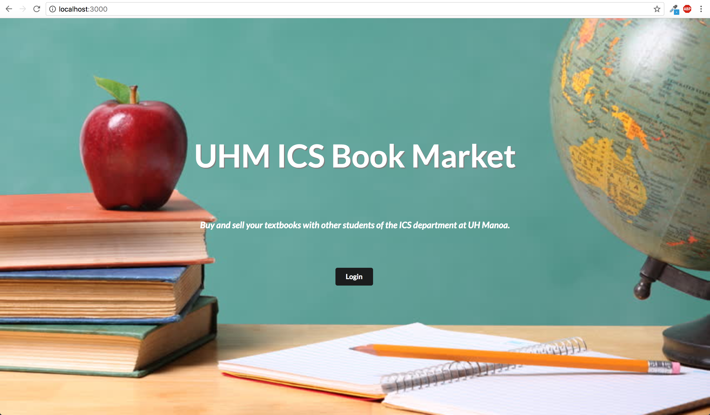

Anyone with a UH account can login to ICSBookMarket by clicking on the login button. The UH CAS authentication screen then appears and requests your UH account and password: 

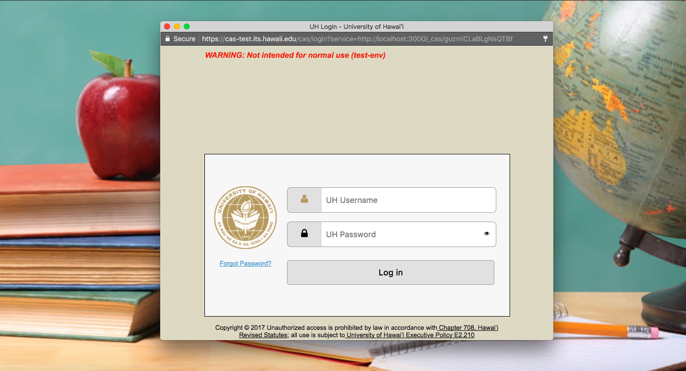

Once authenticated, you can look up books for sale or post your own books for sale. 

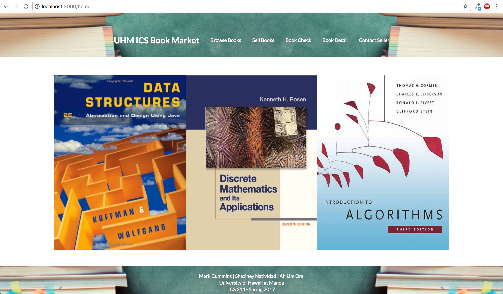

The "Browse Books" option displays a list of all the textbooks required for ICS majors.

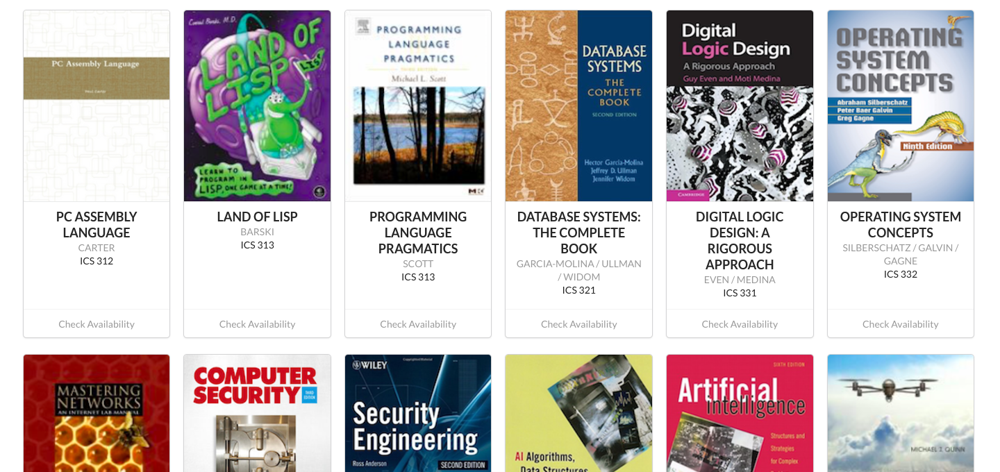

Selecting a particular textbook shows all posts that have that book up for sale.

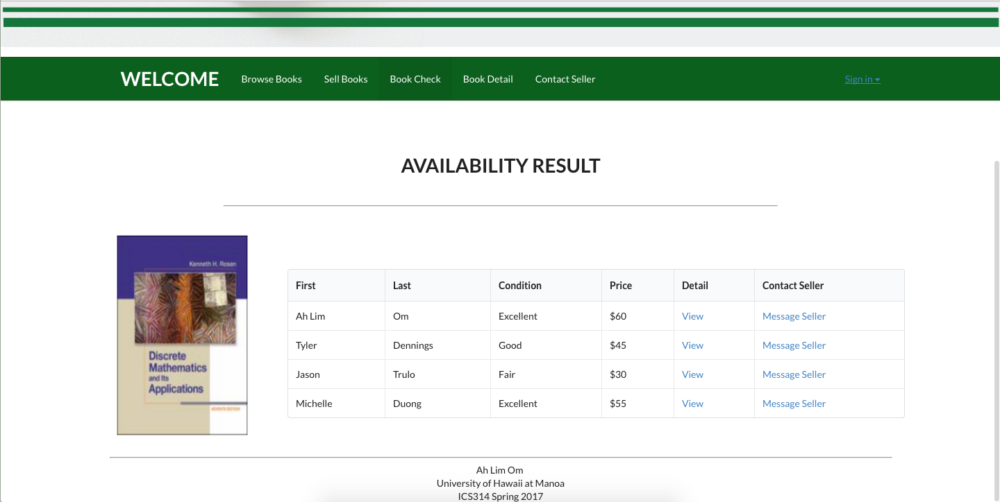

Students who want to post their textbooks for sale can fill out a form to specify the book, price, condition, and their contact information. 

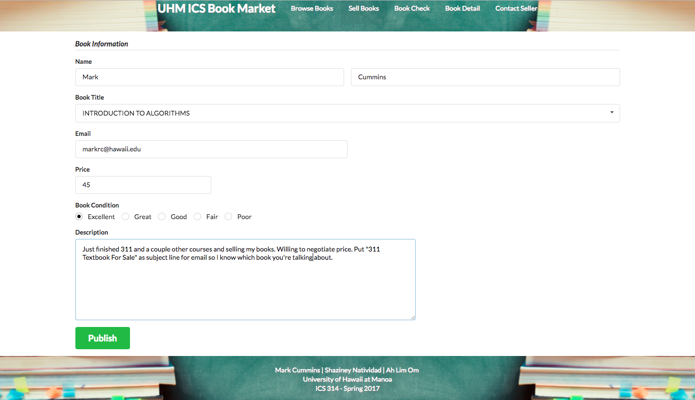

After a sale has been published, the user will be redirected to their books page, showing all the books they have up for sale. Users are able to edit books for sale or delete the post entirely if it has been sold.  

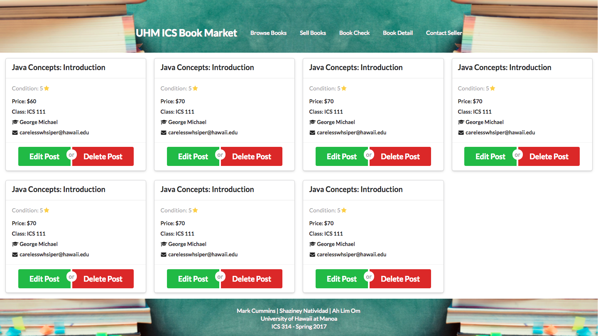

# Installation
First, [install Meteor](https://www.meteor.com/install).

Second, [download a copy of ICSBookMarket](https://github.com/icsbookmarket/icsbookmarket.git), or clone it using git.
  
Third, cd into the app/ directory and install libraries with:

```
$ meteor npm install
```
Fourth, run the system with:

```
$ meteor npm run start
```

If all goes well, the application will appear at [http://localhost:3000](http://localhost:3000). If you have an account on the UH test CAS server, you can login.

# Application Design

## Directory structure

The top-level directory structure contains:

```
app/        # holds the Meteor application sources
config/     # holds configuration files, such as settings.development.json
.gitignore  # don't commit IntelliJ project files, node_modules, and settings.production.json
```

This structure separates configuration files (such as the settings files) in the config/ directory from the actual Meteor application in the app/ directory.

The app/ directory has this top-level structure:

```
client/
  lib/           # holds Semantic UI files.
  head.html      # the <head>
  main.js        # import all the client-side html and js files. 

imports/
  api/           # Define collection processing code (client + server side)
    base/
    book/
    bookforsale/
    interest/
    profile/
    
  startup/       # Define code to run when system starts up (client-only, server-only)
    client/        
    server/        
  ui/
    components/  # templates that appear inside a page template.
    layouts/     # Layouts contain common elements to all pages (i.e. menubar and footer)
    pages/       # Pages are navigated to by FlowRouter routes.
    stylesheets/ # CSS customizations, if any.

node_modules/    # managed by Meteor

private/
  database/      # holds the JSON file used to initialize the database on startup.

public/          
  images/        # holds static images for landing page and predefined sample users.
  
server/
   main.js       # import all the server-side js files.
```

## Import conventions

This system adheres to the Meteor 1.4 guideline of putting all application code in the imports/ directory, and using client/main.js and server/main.js to import the code appropriate for the client and server in an appropriate order.

This system accomplishes client and server-side importing in a different manner than most Meteor sample applications. In this system, every imports/ subdirectory containing any Javascript or HTML files has a top-level index.js file that is responsible for importing all files in its associated directory.   

Then, client/main.js and server/main.js are responsible for importing all the directories containing code they need. For example, here is the contents of client/main.js:
```
import '/imports/startup/client';
import '/imports/ui/components/form-controls';
import '/imports/ui/components/directory';
import '/imports/ui/components/user';
import '/imports/ui/components/landing';
import '/imports/ui/layouts/directory';
import '/imports/ui/layouts/landing';
import '/imports/ui/layouts/shared';
import '/imports/ui/layouts/user';
import '/imports/ui/pages/directory';
import '/imports/ui/pages/filter';
import '/imports/ui/pages/landing';
import '/imports/ui/pages/user';
import '/imports/ui/pages/browse-books';
import '/imports/ui/pages/available-books';
import '/imports/ui/pages/add-books';
import '/imports/ui/pages/home';
import '/imports/ui/pages/sell-books';
import '/imports/ui/pages/your-books';
import '/imports/ui/stylesheets/style.css';
import '/imports/api/base';
import '/imports/api/profile';
import '/imports/api/interest';
import '/imports/api/book';
import '/imports/api/bookforsale';
```
Apart from the last line that imports style.css directly, the other lines all invoke the index.js file in the specified directory.

We use this approach to make it more simple to understand what code is loaded and in what order, and to simplify debugging when some code or templates do not appear to be loaded.  In our approach, there are only two places to look for top-level imports: the main.js files in client/ and server/, and the index.js files in import subdirectories. 

Note that this two-level import structure ensures that all code and templates are loaded, but does not ensure that the symbols needed in a given file are accessible.  So, for example, a symbol bound to a collection still needs to be imported into any file that references it. 

## Naming conventions

This system adopts the following naming conventions:

  * Files and directories are named in all lowercase, with words separated by hyphens. Example: accounts-config.js
  * "Global" Javascript variables (such as collections) are capitalized. Example: Bookdata.
  * Other Javascript variables are camel-case. Example: bookdataList.
  * Templates representing pages are capitalized, with words separated by underscores. Example: Browse_Books_Page. The files for this template are lower case, with hyphens rather than underscore. Example: browse-books-page.html, browse-books-page.js.
  * Routes to pages are named the same as their corresponding page. Example: Browse_Books_Page.
  
## Data model

The ICSBookMarket data model is implemented by multiple Javascript classes

## CSS

Note that the user pages contain a menu fixed to the top of the page, and thus the body element needs to have padding attached to it.  However, the landing page does not have a menu, and thus no padding should be attached to the body element on that page. To accomplish this, the [router](https://github.com/icsbookmarket/uhmicsbookmarket/blob/master/app/imports/startup/client/router.js) uses "triggers" to add an remove the appropriate classes from the body element when a page is visited and then left by the user. 

## Routing

For display and navigation among its four pages, the application uses [Flow Router](https://github.com/kadirahq/flow-router).

Routing is defined in [imports/startup/client/router.js](https://github.com/ics-software-engineering/meteor-application-template/blob/master/app/imports/startup/client/router.js).

## Authentication

For authentication, the application uses the University of Hawaii CAS test server, and follows the approach shown in [meteor-example-uh-cas](http://ics-software-engineering.github.io/meteor-example-uh-cas/).

When the application is run, the CAS configuration information must be present in a configuration file such as  [config/settings.development.json](https://github.com/ics-software-engineering/meteor-application-template/blob/master/config/settings.development.json). 

Anyone with a UH account can login and use UHMICSBookMarket to create a portfolio.  A profile document is created for them if none already exists for that username.

## Authorization

The landing page is public; anyone can access this page.

All other pages require authorization. You must be authenticated via the UH test CAS server. Pages are accessed using the authenticated username which is then specified within the URL. 

To prevent people from accessing pages they are not authorized to visit, template-based authorization is used following the recommendations in [Implementing Auth Logic and Permissions](https://kadira.io/academy/meteor-routing-guide/content/implementing-auth-logic-and-permissions).

## Configuration

The [config](https://github.com/manoabookswap/manoabookswap/tree/master/config) directory is intended to hold settings files.  The repository contains one file: [config/settings.development.json](https://github.com/manoabookswap/manoabookswap/blob/master/config/settings.development.json).

The [.gitignore](https://github.com/manoabookswap/manoabookswap/blob/master/.gitignore) file prevents a file named settings.production.json from being committed to the repository. So, if you are deploying the application, you can put settings in a file named settings.production.json and it will not be committed.

ManoaBookSwap checks on startup to see if it has an empty database in [initialize-database.js](https://github.com/manoabookswap/manoabookswap/blob/master/app/imports/startup/server/initialize-database.js), and if so, loads the file specified in the configuration file, such as [settings.development.json](https://github.com/manoabookswap/manoabookswap/blob/master/config/settings.development.json).  For development purposes, a sample initialization for this database is in [initial-collection-data.json](https://github.com/manoabookswap/manoabookswap/blob/master/app/private/database/initial-collection-data.json).

## Quality Assurance

### ESLint

BowFolios includes a [.eslintrc](https://github.com/icsbookmarket/uhmicsbookmarket/blob/master/app/.eslintrc) file to define the coding style adhered to in this application. You can invoke ESLint from the command line as follows:

```
meteor npm run lint
```

ESLint should run without generating any errors.  

It's significantly easier to do development with ESLint integrated directly into your IDE (such as IntelliJ).

# Development History

The development process for UHMICSBookMarket conformed to [Issue Driven Project Management](http://courses.ics.hawaii.edu/ics314s17/modules/project-management/) practices. In a nutshell, development consists of a sequence of Milestones. Milestones consist of issues corresponding to 2-3 day tasks. GitHub projects are used to manage the processing of tasks during a milestone.  

The following sections document the development history of the UHM ICS BookMarket.

## Milestone 1: Mockup development

This milestone started on April 2, 2017 and ended on April 13, 2017.

The goal of Milestone 1 was to create a set of HTML pages providing a mockup of the pages in the system. To simplify things, the mockup was developed as a Meteor app. This meant that each page was a template and that FlowRouter was used to implement routing to the pages. 

Mockup for the following pages were implemented during M1:


Milestone 1 was implemented as [UHM ICS Book Market GitHub Milestone M1](https://github.com/icsbookmarket/uhmicsbookmarket/milestone/1)

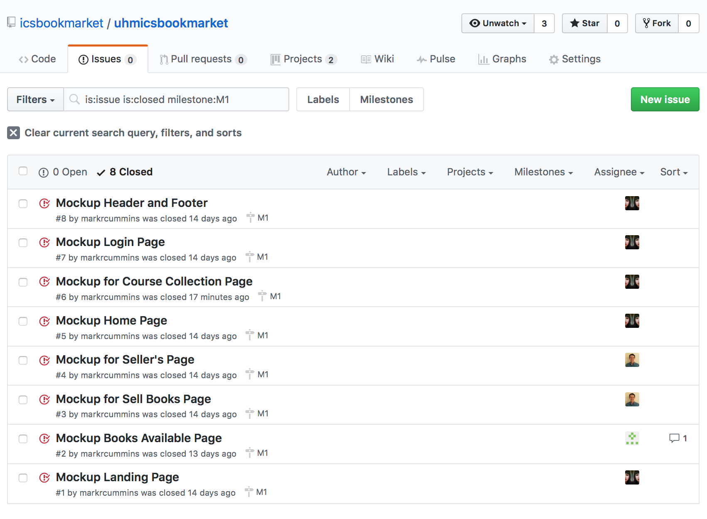

Milestone 1 consisted of eight issues, and progress was managed via the [UHM ICS Book Market GitHub Project M1](https://github.com/icsbookmarket/uhmicsbookmarket/projects/1):

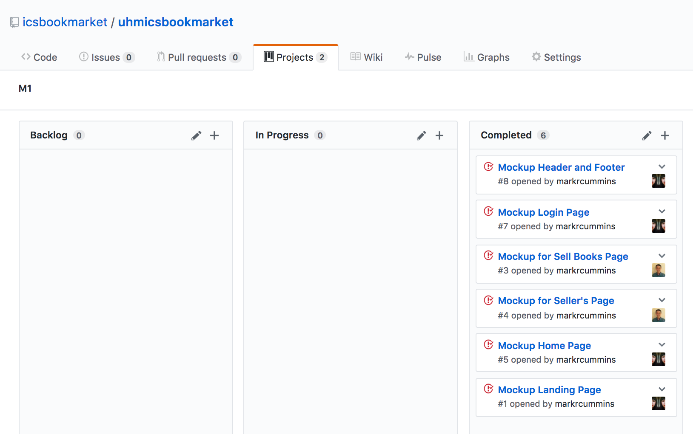

Each issue was implemented in its own branch, and merged into master when completed:

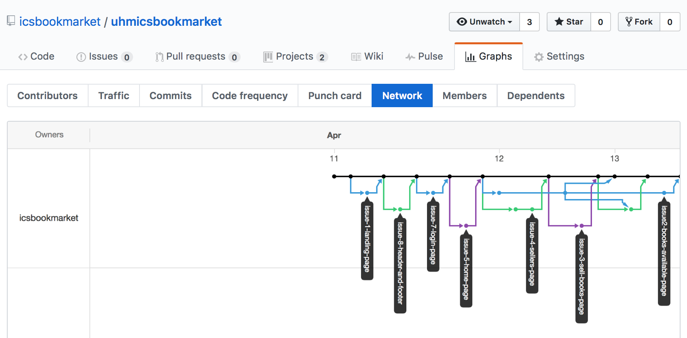

## Milestone 2: Data Model Development

This milestone started on April 14, 2017 and ended on April 26, 2017.

The goal of Milestone 2 was to implement the various collections needed for our application into the underlying Mongo database.

Milestone 2 was implemented as [UHM ICS Book Market GitHub Milestone M2](https://github.com/icsbookmarket/uhmicsbookmarket/milestone/2)

The current deplyment of our application can be seen at [Meteor App Deployment](https://galaxy.meteor.com/app/uhmicsbookmarket.meteorapp.com)

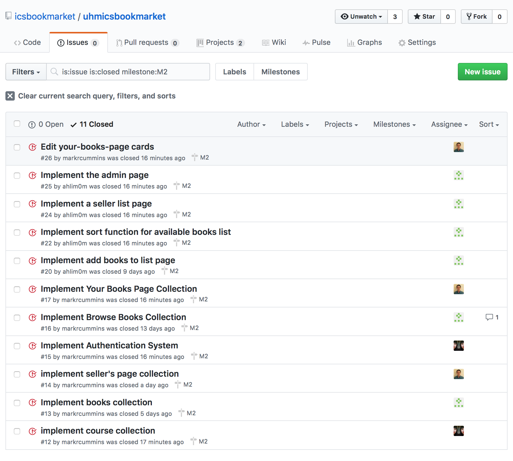

Milestone 2 consisted of seven issues, and progress was managed via the [UHM ICS Book Market GitHub Project M2](https://github.com/icsbookmarket/uhmicsbookmarket/projects/2):

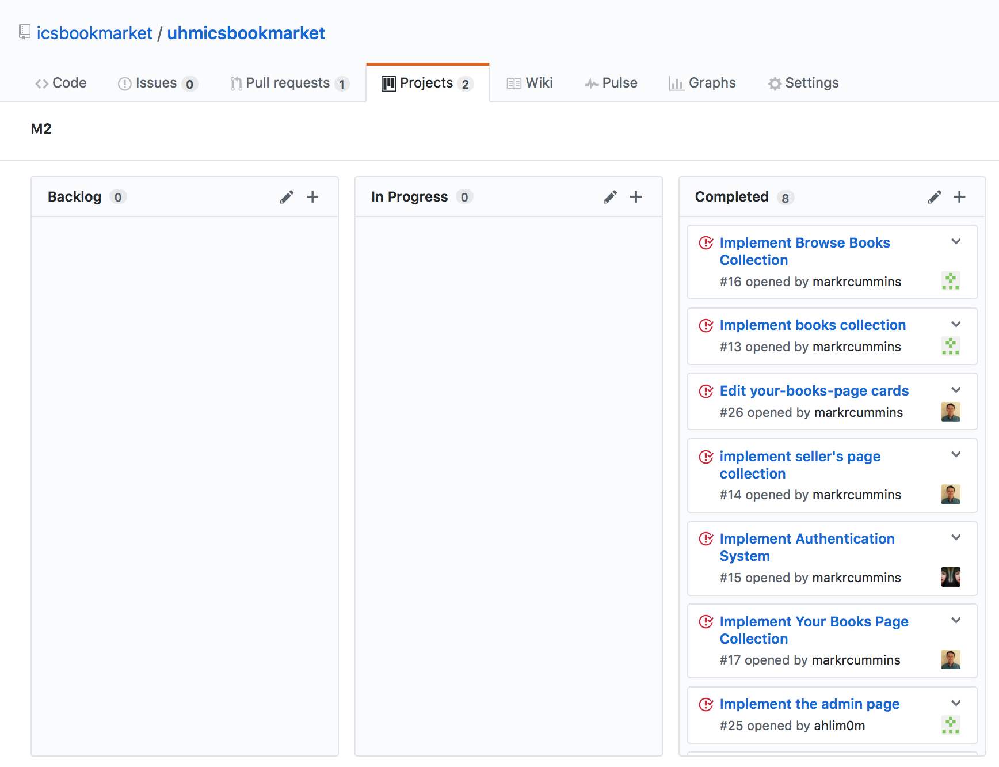

Each issue was implemented in its own branch, and merged into master when completed:

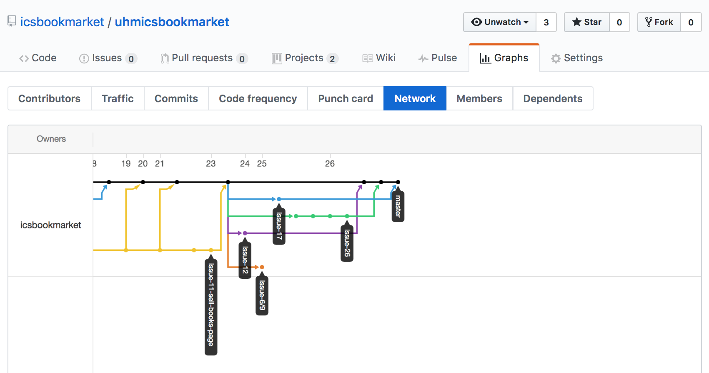

## Milestone 3: Connect to UI and Data Model
 This milestone started April 27 and ended May 9, 2017.
 
 The goal of Milestone 3 was to combine the functionality between the user interface and the data collections. We also implemented issues that weren't addressed in Milestone 2.
 
 Milestone 3 is implemented as [ICS Book Market Github Milestone M3](https://github.com/icsbookmarket/icsbookmarket/milestone/3):
 
 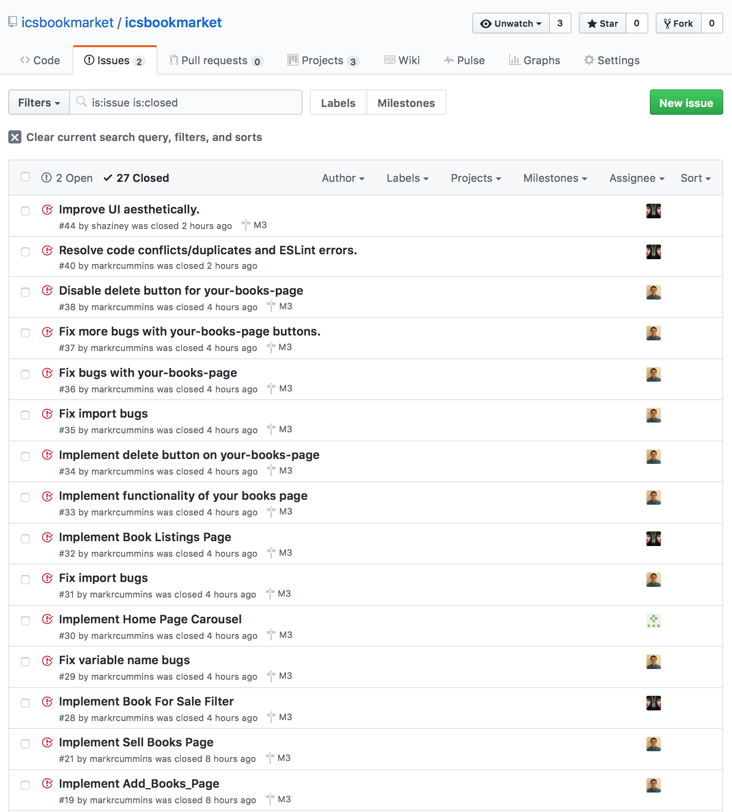
 
 MileStone 3 consisted of 29 issues, 27 that were completed.
 
 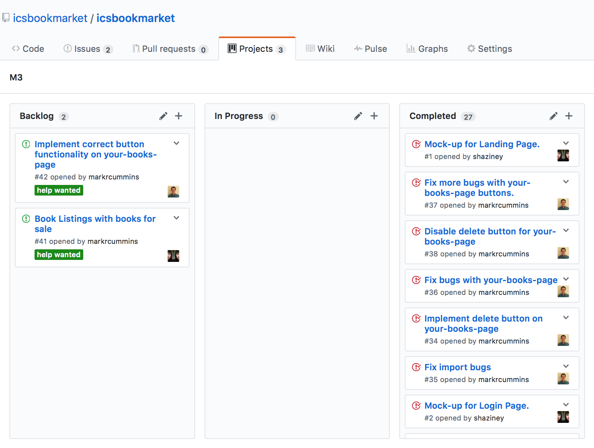
 
 Each issue was implemented in its own branch, then merged to master when completed:
 
 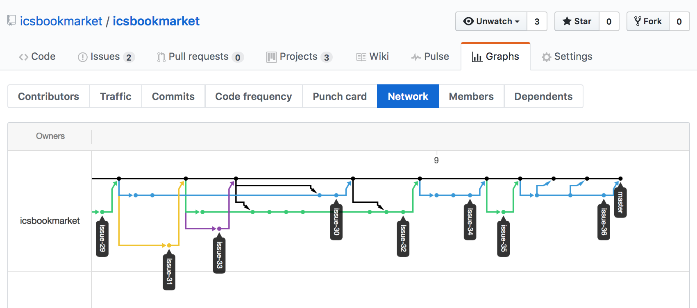
 
 
 ## End User Testing
 
We asked six people to test our app out and give feedback on the design and functionality of the app. We had them try out the app and answer some questions regarding it. The six were:
 
 * Vincent DiRienzo, Computer Science
 * Tyler Chong, Computer Science
 * Sean Takafuji, Computer Science
 * Lancen Dac, Computer Science
 * Mark Tenorio, Electrical Engineering
 * Celine Chan, Computer Science
 
 ICS Book Market Testing
 
Question 1: What did you think of the app?
* Vincent: "The app was not bad. The website is clean. The homepage is very nice. The add books and sell books pages up on the top were confusing."
* Tyler: "Didn't work. Wish it expanded to all books."
* Lancen: "Decent."
* Mark: "Innovatve."
* Sean: "Pretty good concept."
* Celine: "It was cool. Nice idea."

Question 2: Do you like the design? Is it intuitive, awkward, or...?
* Vincent: "It looks like a basic website. But it's nice to look at, specifically the top menu."
* Tyler: "It was very, semantic."
* Lancen: "Pretty intuitive. You press the button, and you go there."
* Mark: "It was smooth, not confusing. I like how there isn't any hover over dropdown menus as I don't like them."
* Sean: "Design was nice."
* Celine: "Intuitive, simple, and easy."

Question 3: If this app had full functionality, would you use it?
* Vincent: "I would use it, but it would on the userbase and how fast I can buy and sell books."
* Tyler: "Anything is better than the bookstore."
* Lancen: "If the app was free to use, I would use it to sell books."
* Mark: "Yes."
* Sean: "Probably."
* Celine: "Yeah."

Question 4: Would you sell books on this app over the buy back program the UHM BookStore offers?
* Vincent: "Yes."
* Tyler: "Yes."
* Lancen: "Yes."
* Mark: "Yes, the bookstore takes a huge cut out my books."
* Sean: "Anything over selling back to the bookstore."
* Celine: "Yes."

Question 5: Would you this app to incorporate books from all majors at UH Manoa?
* Vincent: "Yes, of course."
* Tyler: "Yes."
* Lancen: "ICS is a good start, but it's always great to expand."
* Mark: "Maybe, I don't want it filled up with literature."
* Sean: "No, only for STEM related textbooks."
* Celine: "Yes."

Question 6: Would you rather have an in-app messenger to communicate with others or have users directly message you by email?
* Vincent: "Email, I check that all the time."
* Tyler: "Email."
* Lancen: "If there could be notifications on your phone/computer, an in-app messenger would be preferable."
* Mark: "In-app messenger for security reasons. I don't want my uh email up on an app."
* Sean: "In-app, I don't want people knowing my email account."
* Celine: "I'd rather use email. I'd forget to check the app if there was an-app messenger."

Some Remarks:
* Mark: "The email to button should always be the mail icon because I can't righ-click "copy address" when it's a button. This is the case especially with Windows computers that don't have a mail server pop up when I click on the mail button."
* Everybody: "The edit and delete buttons don't work."
* Mark: "Can be this a mobile app? I think more people would use their phones over a computer."


